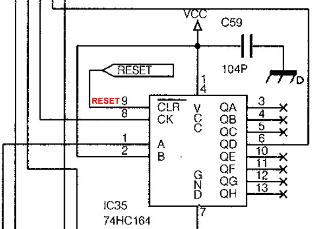
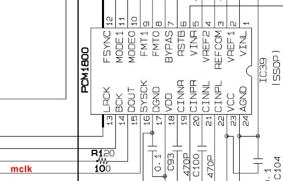
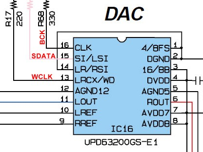

# 18bit-DIT
Adding  digital output for old synths

Surely everyone who used to know DOS era met in games the choice of musical accompaniment - General MIDI, Roland Sound Canvas, Yamaha XG. I will not talk about what wonderful devices these are, and how well they played MIDI. Until the end of the 90s, all these home desktop romplers, like most other professional devices, had only analog outputs, however, they were quite acceptable in quality. In early 2010, out of nostalgia, I bought several devices of that era on ebay - these are the Roland Sound Canvas 88 Pro, <a href="https://github.com/vetal-esher/MT32-DIT">Roland MT-32</a>, Yamaha MU128 and Yamaha AN200. The first three should be familiar to gamers of the early 90s, while the AN200 module is an analog modeling synthesizer based on the Yamaha PLG150-AN plug-in card. Later Yamaha MU1000/2000 tone generators were also sold on the site - their difference from the MU128 consisted in a slightly expanded version of the sample bank, as well as in the presence of an optical TOSLINK output.

Actually, the presence of optics in the MU2000 prompted me to start comparing circuits to see if it was possible to modify the MU128 circuit and get a digital output on my own. In the MU2000 service manual, the optical output circuitry is based on a proprietary Yamaha YM3437C chip, which is very difficult to get for an ordinary radio amateur. We need to look for a more general DIT. A Google search on this topic led me to a <a href="https://nfggames.com/forum2/index.php?topic=4063.0">mod for MU10</a>. The author of the mod relied on the <a href="http://www3.big.or.jp/~fujikko/sc88vl/kaizo.html">Japanese mod for the Roland SC-88VL</a>. The mod is based on the TC9231N chip from Toshiba, which implements a digital audio interface according to the SPDIF/TOSLINK standard. The chip can be ordered on ebay, it costs an average of $ 2.5 per piece (note: this was in 2010, now the chip is almost impossible to find); the rest of the parts are sold at any radio store. I assembled a Japanese version on a breadboard, and it turned out to be working - with a small caveat. The DAC of the Roland SC88 is 18-bit, while the TC9231N is 16-bit. The Japanese author made a binding for this, which allows either cutting off the top 2 bits in the stream - which could lead to clipping, or shifting the stream 2 bits lower (cutting off the bottom 2 bits), which led to a decrease in volume. In any case, 2 bits of information were lost - and that did not suit me.

I started looking for a transceiver that works with 18-bit stream in "hardware" mode, i.e. that does not require setting the operating mode using an additional microcontroller. After a lot of experimentation with DIT 4096, 4192, TC9271N and others, I finally found a transceiver that works native with 18-bit stream - AKM AK4103AVF. Thanks to the internal pull-up and pull-down resistors, you can build the scheme by minimum of components.

Let's sketch out the diagram first. Given that the board should be as versatile as possible, all configurable pins should be placed on jumpers. The output is bound according to the datasheet as consumer S/PDIF. If XLR AES3 (AES/EBU) is needed, see AK4103 datasheet, also there you need another configuration on FS0-FS3 pins.

The input is I2S, for this we need the data, lrck, bck and sclk lines on the sources. In different datasheets, these lines may be called differently, but their essence is always the same - DATA=SI=MDAC=SDTI, LRCK=LRCX=MWCLK, CLK=MQCLK, etc. All of these lines should be easily found in the circuits included in the DAC, with the exception of sysclk, which will have to be searched by the oscilloscope at different points in the circuit. Usually, in I2S, sysclk (or mclk) is not needed for transmission, but in AK4103AVF the line is used for correct synchronization.

It has been noticed that if the circuit is turned on at the same time as the module, the AK4103 does not pick up the frequency and the digital output is silent. Empirically revealed that the frequency is caught after the initialization of the module, you need a power delay. In 2016, without thinking twice, I simply brought the "spdif reset" button to the case (shown in the diagram). At the beginning of June 2022, <a href="https://github.com/nikitalita/MU100-DIT">nikitalita</a> contacted me and suggested to use the BRESET line in the PLG expansion connector. An oscilloscope check revealed that BRESET remained low for about 70ms, which was enough for the DIT to pick up the frequency. Let's find the lines on all three devices:

<table border=1>
<tr><th>I2S</th><th>Roland SC-88 Pro</th><th>Yamaha MU128</th><th>Yamaha AN200</th></tr>
<tr><td>sysclk</td>	<td>CN105 pin 5</td>	<td>IC39 pin 16</td>	<td>IC17 pin 160</td></tr>
<tr><td>data</td>	<td>CN105 pin 3</td>	<td>IC36 pin 15</td>	<td>IC16 pin 15</td></tr>
<tr><td>qclk(bclk)</td>	<td>IC35 pin 8</td>	<td>IC36 pin 16</td>	<td>IC16 pin 16</td></tr>
<tr><td>wclk(lrck)</td>	<td>CN105 pin 6</td>	<td>IC36 pin 13</td>	<td>IC16 pin 13</td></tr>
<tr><td>reset</td>	<td>IC35 pin 9</td>		<td>IC34 pin 19</td>	<td>CN5 pin 4</td></tr>
</table>

<h3>Roland SC-88 Pro</h3>

<h3>Yamaha MU128</h3>

<h3>Yamaha AN200</h3>

The SC88 has an 18-bit PCM69AU, while the MU128 and AN200 have an 18-bit NEC D63200. According to the specification, the SC-88 has a sample rate of 32kHz, MU128 and AN200 - 44kHz. Following the datasheet, we need to set the following modes: audio routing mode - normal, synchronous mode, 18bit right justified. Let's measure frequencies:
<table border=1>
<tr><th></th><th>wlck</th><th>sysclk</th><th>qclk</th><th>dif0</th><th>dif1</th><th>dif2</th><th>ans</th><th>trans</th><th>cks0</th><th>cks1</th><th>fs0</th><th>fs1</th><th>fs2</th><th>fs3</th></tr>

<tr><td>default</td><td>-</td><td>-</td><td>-</td><td>0</td><td>0</td><td>0</td><td>1</td><td>float</td><td>1</td><td>0</td><td>0</td><td>0</td><td>0</td><td>0</td></tr>
<tr><td>SC88</td>
<td>32000Hz</td><td>8.192 MHz</td><td>8.192 MHz</td>
<td>1</td><td>0</td><td>0</td>
<td>1</td><td>0</td>
<td>1</td><td>0</td>
<td>1</td><td>1</td><td>0</td><td>0</td>
</tr>
<tr><td>MU128</td>
<td>44100Hz</td><td>11.2896 MHz</td><td>2.8224 MHz</td>
<td>0</td><td>0</td><td>0</td>
<td>1</td><td>0</td>
<td>1</td><td>0</td>
<td>0</td><td>0</td><td>0</td><td>0</td>
</tr>
<tr><td>AN200</td>
<td>44100Hz</td><td>16.9344 MHz</td><td>2.8224 MHz</td>
<td>0</td><td>0</td><td>0</td>
<td>1</td><td>0</td>
<td>1</td><td>0</td>
<td>0</td><td>0</td><td>0</td><td>0</td>
</tr>
</table>
By the way, in 2010, the service manual for the MU128 could only be found on the same Ebay for money. I bought it, got a PDF, and immediately shared it on my site for free for everyone who seeks it. After a few weeks, this service manual was no longer sold :)

This circuit was assembled on a breadboard and successfully worked in MU128 and AN200 in 2016.

In 2021, I suddenly decided to re-release the development in a decent way.

Gerbers: <a href="hardware/gerber/dit_0.2_gerber.zip">dit_0.2_gerber.zip</a>

<h2>Partlist</h2>
<table border=1>
<tr><th>Reference</th><th>Value</th><th>Package</th></tr>
<tr><td>U1</td><td>AK4103AVF</td><td>TSSOP-24</td></tr>
<tr><td>T1</td><td>PE-65612NL, TC-612</td><td></td></tr>
<tr><td>C1, C2, C3</td><td>100nF</td><td>0603</td></tr>
<tr><td>R1</td><td>330R</td><td>0402</td></tr>
<tr><td>R2</td><td>100R</td><td>0402</td></tr>
</table>

<h2>Roland SC88 Pro notes</h2>

According to Japanese DIT project, the actual stream is 20bit, so AK4103 can be configured as 20-bit right justified, but you will get only significantly lower volume. This is the same melody recorded 20-bit first, then 18-bit:

<h2>Links</h2>

<a href="https://esher.ru/blog/887.html">https://esher.ru/blog/887.html</a> My initial blog post in 2016 

<a href="https://github.com/nikitalita/MU100-DIT">MU100-DIT</a>, a parallel project for MU-series using TOSLINK, by nikitalita

<a href="https://kurohane.net/wiki/index.php?SC-88Pro%E3%81%AB%E5%85%89%E3%83%87%E3%82%B8%E3%82%BF%E3%83%AB%E5%87%BA%E5%8A%9B%E3%82%92%E4%BB%98%E3%81%91%E3%82%8B">Japanese project using AK4103 too</a>

<a href="https://esher.ru/i/f/887/887/AK4103AVF.pdf">AKM AK4103A datasheet</a>

<a href="https://esher.ru/i/f/900/900/an200sm.pdf.gz">Yamaha AN200 service manual</a>

<a href="https://esher.ru/i/f/888/888/Roland_SC-88Pro_ServiceNotes.pdf.gz">Roland SC88 Pro service notes (in japan)</a>

<a href="https://esher.ru/i/f/869/869/mu128sm-e.pdf.gz">Yamaha MU128 service manual</a>

<a href="https://github.com/vetal-esher/MT32-DIT">MT32-DIT, trying to SPDIF the legendary Roland MT-32</a>

